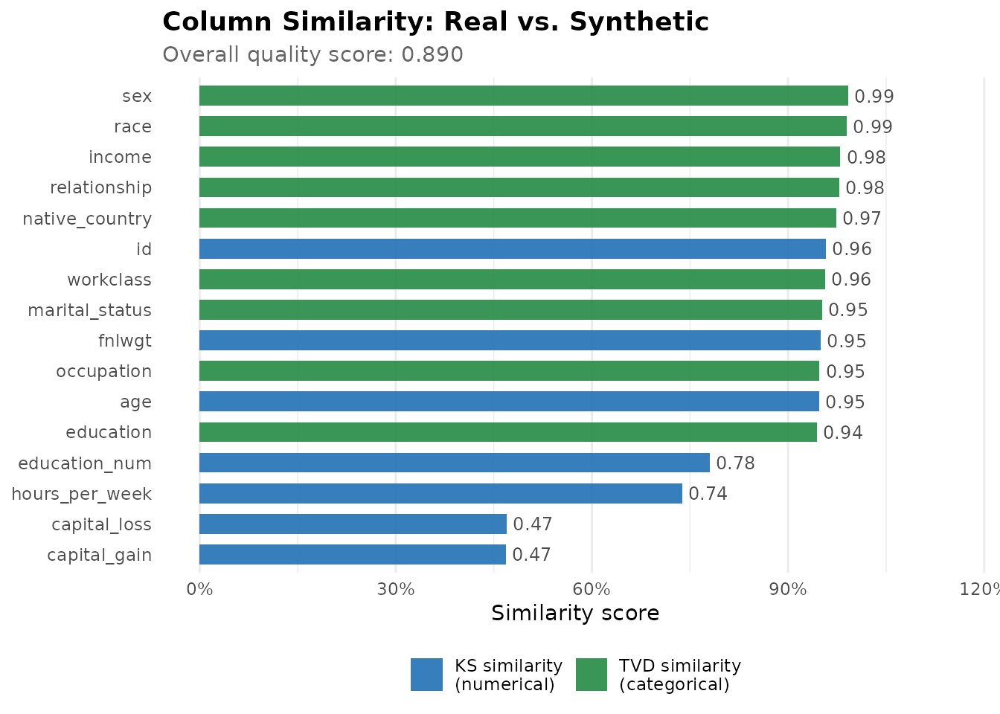
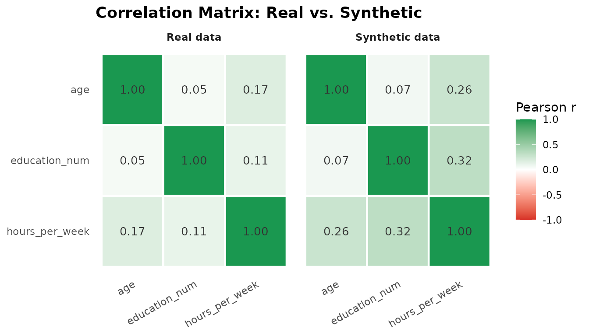
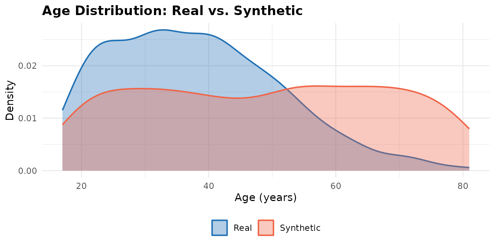
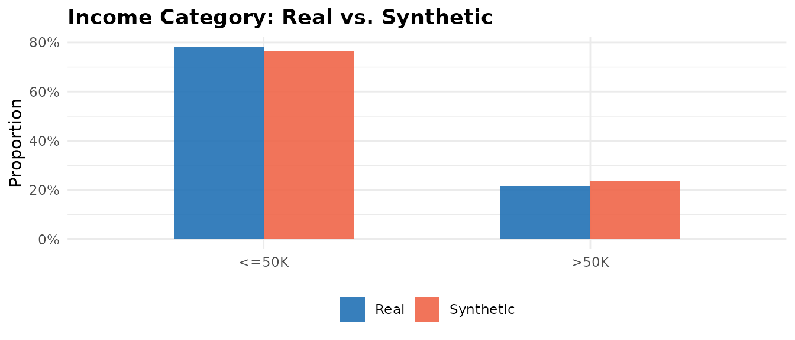
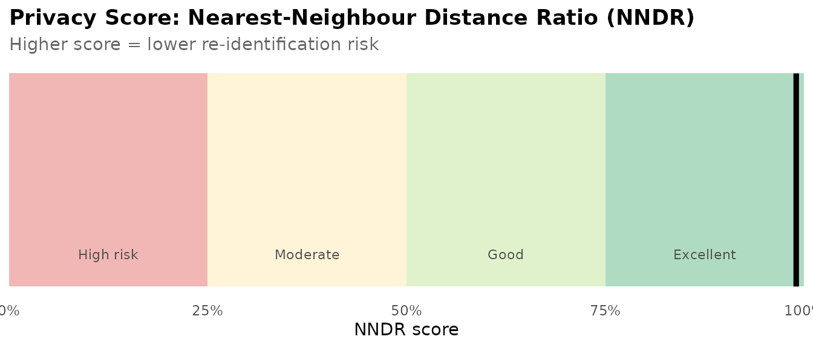

# Getting Started with rsdv: A Practitioner's Guide to Synthetic Data Generation

## Introduction

Administrative records, survey microdata, and clinical data share a
common problem: the very features that make them analytically valuable —
individual-level detail, rare subgroup representation, longitudinal
linkage — also make them difficult to share. Data governance procedures,
informed consent agreements, and privacy regulations all impose friction
between the data and the analyst. Synthetic data generation addresses
this problem by learning the statistical structure of a real dataset and
using that structure to generate a new dataset whose rows are entirely
artificial but whose distributional properties approximate the original.

`rsdv` is an R implementation of the [Synthetic Data Vault
(SDV)](https://sdv.dev/) framework (Patki, Wedge, and Veeramachaneni
2016), bringing a Gaussian copula–based synthesis workflow to native R.
The package is designed for the applied researcher who needs to generate
a shareable analogue of a sensitive dataset, evaluate how closely the
synthetic version preserves the real data’s distributions and
correlation structure, and quantify the privacy protection the synthesis
affords. The workflow follows four steps: describe the column types, fit
the synthesizer, generate synthetic rows, and evaluate the result.

------------------------------------------------------------------------

## The R Synthetic Data Ecosystem

The R ecosystem for synthetic data generation encompasses several
methodological traditions, each suited to a different set of
requirements.

**Sequential imputation methods.** `synthpop` (Nowok, Raab, and Dibben
2016) is the most widely cited R synthesis package. It generates
synthetic variables one at a time, conditioning each column on those
already synthesised using parametric models or classification and
regression trees (CART). The sequential approach is flexible and
interpretable, and `synthpop` has mature support for multiple-imputation
inference and disclosure risk measurement. It is the standard tool in
official statistics applications, particularly within UK government data
infrastructure. The limitation of sequential CART for high-dimensional
mixed data is that the joint distribution is approximated
column-by-column rather than modelled as a single object; correlations
among many variables accumulate approximation error across steps.

**Adversarial methods.** `arf` (Watson, Blesch, Kapar, and Wright 2023)
implements Adversarial Random Forests, which partition the feature space
into locally independent leaves by iterating between a forest-based
density estimator and a discriminator. On tabular benchmarks it matches
or outperforms deep generative models while running roughly 100 times
faster — a meaningful difference for practitioners who cannot afford GPU
compute. It handles mixed variable types naturally. The package is
primarily oriented toward ML researchers rather than practitioners in
regulated industries; it does not provide metadata schemas, quality
reports, or privacy metrics.

**Rank-based methods.** `synthesizer` (Van der Loo, Statistics
Netherlands) synthesises data using empirical rank-based correlation,
with a single `rankcor` parameter governing the privacy-utility
tradeoff. The approach is fast, handles missing data patterns, and is
appropriate for settings where a lightweight baseline synthesis is
needed. Quality metrics beyond pMSE are not built in.

**Disclosure control suites.** `sdcMicro` (Templ, Kowarik, and Meindl
2015) is a comprehensive toolkit for statistical disclosure control,
covering suppression, perturbation, microaggregation, and synthesis
within a unified framework used by national statistical offices
globally. Synthesis in `sdcMicro` is one method among many rather than
the primary product; the workflow is designed around disclosure risk
assessment and perturbation pipelines rather than generative modeling.

**Copula infrastructure.** The `copula` package (Hofert, Kojadinovic,
Mächler, and Yan) is the foundational R library for copula families
including Gaussian, t, Clayton, Gumbel, Frank, and Joe. `rsdv` uses
`copula` internally for fitting and sampling. Packages such as
`heterocop` (Tomilina, Mazo, and Jaffrézic 2024) and `GenOrd` address
the methodologically adjacent problem of Gaussian copula estimation for
mixed discrete and continuous variables, though oriented toward network
inference and simulation respectively.

### Where `rsdv` fits

`rsdv` occupies the intersection of properties no single existing
package combines: a parametric copula model for joint distribution
preservation, first-class support for mixed variable types (continuous,
categorical, boolean), an integrated quality and privacy evaluation
report, and a tidy `metadata → fit → sample → evaluate` API. The
disclosure control suites (`sdcMicro`, `synthpop`) provide privacy
metrics within their own frameworks but are not designed around
generative modelling as the primary product. `rsdv`’s architecture is
designed so that the Gaussian copula can be replaced by a vine copula or
a deep generative model without changing the user-facing interface,
providing a clear upgrade path as analytical requirements grow.

------------------------------------------------------------------------

## The Gaussian Copula: A Practitioner’s Introduction

A copula is a joint distribution that separates the behaviour of each
individual variable from the way variables depend on one another.
Sklar’s theorem (Sklar 1959) guarantees that any multivariate
distribution can be written as a copula applied to its marginal CDFs.
For synthesis, this decomposition is useful: we can estimate the
dependence structure from data and then recombine it with estimated or
empirical marginal distributions to generate new observations.

The Gaussian copula models dependence through a correlation matrix. The
synthesis pipeline has five stages:

**1. Transform to uniform.** Each numerical value is mapped to the
interval (0, 1) through its fitted marginal CDF (the probability
integral transform). `rsdv` fits a parametric family per column —
`norm`, `beta`, `gamma`, `truncnorm`, or `uniform` — and by default
(`default_distribution = "auto"`) selects the best-fitting family by
Kolmogorov-Smirnov distance. You can override the choice per column via
`numerical_distributions`. Categorical and boolean columns are mapped to
(0, 1) by their cumulative-frequency intervals (each value is placed
uniformly at random within its category’s interval), so they enter the
copula too.

**2. Map to normal space.** The uniform values are passed through the
standard normal quantile function (Φ⁻¹), yielding pseudo-observations on
the real line.

**3. Estimate the correlation matrix.** The correlation matrix of the
normal-space pseudo-observations is estimated using inversion of
Kendall’s τ, a rank-based method that is more stable than maximum
likelihood for small samples or tied values.

**4. Sample.** New pseudo-observations are drawn from the fitted
multivariate normal distribution.

**5. Back-transform.** Numerical columns are mapped back through their
fitted quantile function; categorical and boolean columns are decoded by
locating which frequency interval each sampled value falls into.

Because every column — numerical, categorical, and boolean — is embedded
in a single copula, cross-column dependence is preserved across types:
numeric-vs-categorical and categorical-vs-categorical associations, not
just numeric-vs-numeric correlations.

Missing values are handled by fitting the copula on complete cases only.
By default, `rsdv` records the empirical missingness rate for each
column during fitting and reinstates it at sampling time. This approach
models missingness as missing completely at random (MCAR). Systematic
missingness patterns require pre-imputation before synthesis; see the
section on missing data below.

------------------------------------------------------------------------

## Getting Started

### Installation

``` r
# From CRAN:
install.packages("rsdv")

# Development version from GitHub:
remotes::install_github("kvenkita/rsdv")
```

### A five-line synthesis

``` r
library(rsdv)

set.seed(42)

meta  <- metadata(adult_income) |>
  set_column_type("age",            "numerical")  |>
  set_column_type("education_num",  "numerical")  |>
  set_column_type("hours_per_week", "numerical")  |>
  set_column_type("occupation",     "categorical") |>
  set_column_type("income",         "categorical")

syn   <- gaussian_copula_synthesizer(meta) |> fit(adult_income)
synth <- sample(syn, n = 500)

head(synth[, c("age", "education_num", "occupation", "income")])
#>        age education_num      occupation income
#> 1 24.35615     13.218294   Other-service  <=50K
#> 2 35.55372      8.167697 Exec-managerial   >50K
#> 3 52.08036     13.917412 Farming-fishing  <=50K
#> 4 47.64983     12.725404    Adm-clerical   >50K
#> 5 32.57353     10.394470 Exec-managerial  <=50K
#> 6 65.18644      7.970632   Other-service  <=50K
```

------------------------------------------------------------------------

## Describing Your Data: The Metadata System

Every synthesis workflow begins with a column registry that tells `rsdv`
what each variable represents. The registry drives everything downstream
— from how columns are transformed before fitting to what appears in the
quality report.

``` r
meta <- metadata(adult_income) |>
  set_column_type("age",            "numerical")  |>
  set_column_type("education_num",  "numerical")  |>
  set_column_type("hours_per_week", "numerical")  |>
  set_column_type("occupation",     "categorical") |>
  set_column_type("marital_status", "categorical") |>
  set_column_type("income",         "categorical")

print(meta)
#> rsdv Metadata
#>   Columns: 16 
#>     id [numerical]
#>     age [numerical]
#>     workclass [categorical]
#>     fnlwgt [numerical]
#>     education [categorical]
#>     education_num [numerical]
#>     marital_status [categorical]
#>     occupation [categorical]
#>     relationship [categorical]
#>     race [categorical]
#>     sex [categorical]
#>     capital_gain [numerical]
#>     capital_loss [numerical]
#>     hours_per_week [numerical]
#>     native_country [categorical]
#>     income [categorical]
```

**Supported column types:**

| Type            | Description                                                                                  | Example columns                 |
|-----------------|----------------------------------------------------------------------------------------------|---------------------------------|
| `"numerical"`   | Continuous or discrete numeric; modelled through the copula                                  | Age, income, test scores        |
| `"categorical"` | Nominal or ordinal text or factor; embedded in the copula via cumulative-frequency intervals | Occupation, education level     |
| `"boolean"`     | `TRUE`/`FALSE`; embedded in the copula as a two-level categorical                            | Flag variables, binary outcomes |
| `"id"`          | Row identifier; excluded from synthesis                                                      | Record IDs                      |
| `"datetime"`    | Date or timestamp; excluded from synthesis                                                   | Survey date                     |

Automatic column type detection is available: passing a data frame to
[`metadata()`](https://kvenkita.github.io/rsdv/reference/metadata.md)
infers column types from R class. You can then override specific types
with
[`set_column_type()`](https://kvenkita.github.io/rsdv/reference/set_column_type.md).

------------------------------------------------------------------------

## Fitting and Sampling

``` r
set.seed(42)

syn   <- gaussian_copula_synthesizer(meta)
syn   <- fit(syn, adult_income)
synth <- sample(syn, n = 500)
```

The result is a data frame with 500 rows and the same six columns as
`adult_income`. The
[`fit()`](https://generics.r-lib.org/reference/fit.html) call estimates
one transformer per registered column and fits the Gaussian copula
correlation matrix over all modeled columns (numerical, categorical, and
boolean) on complete cases. The
[`sample()`](https://kvenkita.github.io/rsdv/reference/sample.md) call
generates `n` synthetic rows by drawing from the fitted copula and
back-transforming each column through its estimated marginal.

### Choosing marginal distributions

By default each numerical column is fit with the best of five parametric
families — `norm`, `beta`, `gamma`, `truncnorm`, `uniform` — chosen by
Kolmogorov-Smirnov distance (`default_distribution = "auto"`). You can
pin a family globally or per column when you have prior knowledge about
a variable’s shape:

``` r
syn_dist <- gaussian_copula_synthesizer(
  meta,
  numerical_distributions = list(capital_gain = "gamma"),
  default_distribution    = "norm"
) |>
  fit(adult_income)
```

Here `capital_gain` is modeled as gamma (a natural choice for a skewed,
non-negative quantity) while all other numerical columns use a normal
marginal.

------------------------------------------------------------------------

## Conditional Sampling

[`sample_conditions()`](https://kvenkita.github.io/rsdv/reference/sample_conditions.md)
generates rows in which one or more categorical or boolean columns are
held to fixed values, while the remaining columns are drawn
conditionally through the fitted copula (via rejection sampling). This
preserves the modeled dependence between the conditioned columns and the
rest of the table.

``` r
high_earners <- sample_conditions(
  syn,
  data.frame(income = ">50K", .n = 50, stringsAsFactors = FALSE)
)
table(high_earners$income)
#> 
#> >50K 
#>   50
```

The optional `.n` column sets how many rows to generate per condition;
supply multiple rows to request several conditions at once. Conditioning
on numerical columns is not supported (exact equality is ill-defined for
continuous values).

------------------------------------------------------------------------

## Evaluating Quality

A quality report aggregates metrics into the two-property hierarchy used
by SDMetrics: **Column Shapes** (per-column marginal fidelity) and
**Column Pair Trends** (pairwise dependence). The overall score is the
mean of the two properties, so a table with many categorical columns and
few numerical ones is not weighted by raw column counts. ML efficacy,
when requested via `target_col`, is reported separately and excluded
from the overall score.

``` r
qr <- quality_report(adult_income, synth, meta)
print(qr)
#> == rsdv Quality Report ==
#> 
#> Column Similarity (KS, numerical):
#>   id                   0.958
#>   age                  0.948
#>   fnlwgt               0.950
#>   education_num        0.780
#>   capital_gain         0.468
#>   capital_loss         0.470
#>   hours_per_week       0.738
#> 
#> Column Similarity (TVD, categorical):
#>   workclass            0.961
#>   education            0.944
#>   marital_status       0.952
#>   occupation           0.951
#>   relationship         0.978
#>   race                 0.990
#>   sex                  0.992
#>   native_country       0.976
#>   income               0.980
#> 
#> Property scores:
#>   Column Shapes        0.877
#>   Column Pair Trends   0.903
#>     (correlation 0.967, contingency 0.865)
#> 
#> Overall Score:               0.890
```

### Column-level similarity

``` r
col_scores <- rbind(
  data.frame(
    column = qr$ks_scores$column,
    score  = qr$ks_scores$score,
    type   = "KS similarity\n(numerical)",
    stringsAsFactors = FALSE
  ),
  data.frame(
    column = qr$tvd_scores$column,
    score  = qr$tvd_scores$score,
    type   = "TVD similarity\n(categorical)",
    stringsAsFactors = FALSE
  )
)

ggplot2::ggplot(
  col_scores,
  ggplot2::aes(x = reorder(column, score), y = score, fill = type)
) +
  ggplot2::geom_col(width = 0.65, alpha = 0.9) +
  ggplot2::geom_text(
    ggplot2::aes(label = sprintf("%.2f", score)),
    hjust = -0.15, size = 3.2, colour = "grey30"
  ) +
  ggplot2::coord_flip() +
  ggplot2::scale_y_continuous(
    limits = c(0, 1.15),
    labels = scales::percent_format(accuracy = 1)
  ) +
  ggplot2::scale_fill_manual(
    values = c(
      "KS similarity\n(numerical)"    = "#2171b5",
      "TVD similarity\n(categorical)" = "#238b45"
    )
  ) +
  ggplot2::labs(
    title    = "Column Similarity: Real vs. Synthetic",
    subtitle = sprintf("Overall quality score: %.3f", qr$overall_score),
    x        = NULL,
    y        = "Similarity score",
    fill     = NULL
  ) +
  ggplot2::theme_minimal(base_size = 11) +
  ggplot2::theme(
    legend.position    = "bottom",
    panel.grid.major.y = ggplot2::element_blank(),
    plot.title         = ggplot2::element_text(face = "bold"),
    plot.subtitle      = ggplot2::element_text(colour = "grey40")
  )
```



**Kolmogorov-Smirnov (KS) similarity** measures the maximum absolute
difference between the empirical CDFs of a numerical column in the real
and synthetic datasets, scored 0–1 (1 = identical distributions).
**Total variation distance (TVD) similarity** is the analogous measure
for categorical columns: it computes the maximum difference in
probability mass between the real and synthetic frequency distributions,
on the same scale. Together these form the **Column Shapes** property.

The **Column Pair Trends** property captures pairwise dependence:
**correlation similarity** (`1 - |corr_real - corr_syn| / 2`, averaged
over numerical pairs) and **contingency similarity** (`1 - TVD` between
the joint distributions of each categorical pair). Inspect them directly
with
[`correlation_similarity()`](https://kvenkita.github.io/rsdv/reference/correlation_similarity.md)
and
[`contingency_similarity()`](https://kvenkita.github.io/rsdv/reference/contingency_similarity.md),
each of which returns per-pair scores alongside the mean.

### Correlation structure

The Gaussian copula’s primary purpose is to preserve inter-column
correlation. The heatmaps below compare the Pearson correlation matrices
for numerical columns in the real and synthetic datasets.

``` r
num_cols <- c("age", "education_num", "hours_per_week")

cor_real <- round(cor(adult_income[, num_cols], use = "complete.obs"), 3)
cor_syn  <- round(cor(synth[, num_cols],        use = "complete.obs"), 3)

mat_to_long <- function(mat, source) {
  nms <- colnames(mat)
  data.frame(
    var1   = rep(nms, each  = length(nms)),
    var2   = rep(nms, times = length(nms)),
    value  = as.vector(mat),
    source = source,
    stringsAsFactors = FALSE
  )
}

cor_long <- rbind(
  mat_to_long(cor_real, "Real data"),
  mat_to_long(cor_syn,  "Synthetic data")
)
cor_long$var1 <- factor(cor_long$var1, levels = rev(num_cols))
cor_long$var2 <- factor(cor_long$var2, levels = num_cols)

ggplot2::ggplot(cor_long, ggplot2::aes(var2, var1, fill = value)) +
  ggplot2::geom_tile(colour = "white", linewidth = 0.8) +
  ggplot2::geom_text(
    ggplot2::aes(label = sprintf("%.2f", value)),
    size = 3.5, colour = "grey20"
  ) +
  ggplot2::facet_wrap(~source) +
  ggplot2::scale_fill_gradient2(
    low      = "#d73027",
    mid      = "white",
    high     = "#1a9850",
    midpoint = 0,
    limits   = c(-1, 1),
    name     = "Pearson r"
  ) +
  ggplot2::labs(
    title = "Correlation Matrix: Real vs. Synthetic",
    x = NULL, y = NULL
  ) +
  ggplot2::theme_minimal(base_size = 11) +
  ggplot2::theme(
    axis.text.x     = ggplot2::element_text(angle = 30, hjust = 1),
    strip.text      = ggplot2::element_text(face = "bold"),
    legend.position = "right",
    plot.title      = ggplot2::element_text(face = "bold"),
    panel.grid      = ggplot2::element_blank()
  )
```



### Marginal distributions

Overlaid density curves provide a direct visual check on how closely the
synthetic marginals match the real data.

``` r
age_data <- rbind(
  data.frame(value = adult_income$age, source = "Real"),
  data.frame(value = synth$age,        source = "Synthetic")
)

ggplot2::ggplot(age_data, ggplot2::aes(x = value, fill = source, colour = source)) +
  ggplot2::geom_density(alpha = 0.35, linewidth = 0.7) +
  ggplot2::scale_fill_manual(values   = c("Real" = "#2171b5", "Synthetic" = "#ef6548")) +
  ggplot2::scale_colour_manual(values = c("Real" = "#2171b5", "Synthetic" = "#ef6548")) +
  ggplot2::labs(
    title  = "Age Distribution: Real vs. Synthetic",
    x      = "Age (years)", y = "Density",
    fill   = NULL, colour = NULL
  ) +
  ggplot2::theme_minimal(base_size = 11) +
  ggplot2::theme(
    legend.position = "bottom",
    plot.title      = ggplot2::element_text(face = "bold")
  )
```



``` r
income_real  <- as.data.frame(table(adult_income$income) / nrow(adult_income))
income_synth <- as.data.frame(table(synth$income)        / nrow(synth))
names(income_real)  <- c("category", "proportion")
names(income_synth) <- c("category", "proportion")
income_real$source  <- "Real"
income_synth$source <- "Synthetic"
income_data <- rbind(income_real, income_synth)

ggplot2::ggplot(
  income_data,
  ggplot2::aes(x = category, y = proportion, fill = source)
) +
  ggplot2::geom_col(position = "dodge", width = 0.55, alpha = 0.9) +
  ggplot2::scale_y_continuous(labels = scales::percent_format(accuracy = 1)) +
  ggplot2::scale_fill_manual(values = c("Real" = "#2171b5", "Synthetic" = "#ef6548")) +
  ggplot2::labs(
    title = "Income Category: Real vs. Synthetic",
    x = NULL, y = "Proportion", fill = NULL
  ) +
  ggplot2::theme_minimal(base_size = 11) +
  ggplot2::theme(
    legend.position = "bottom",
    plot.title      = ggplot2::element_text(face = "bold")
  )
```



### Diagnostic checks

Where the quality report measures how closely synthetic data *resembles*
the real data, the diagnostic report checks whether it is *structurally
valid* — independent of distributional fidelity. It verifies that
numerical values fall within the observed range (boundary adherence),
that categorical values use only seen categories (category adherence),
and that any primary key is unique and complete (key uniqueness), then
rolls these into a Data Validity score alongside a Data Structure score
for column coverage.

``` r
dr <- diagnostic_report(adult_income, synth, meta)
print(dr)
#> == rsdv Diagnostic Report ==
#> 
#> Data Validity (per column):
#>   id                   boundary adherence   1.000
#>   age                  boundary adherence   1.000
#>   fnlwgt               boundary adherence   1.000
#>   education_num        boundary adherence   1.000
#>   capital_gain         boundary adherence   1.000
#>   capital_loss         boundary adherence   1.000
#>   hours_per_week       boundary adherence   1.000
#>   workclass            category adherence   1.000
#>   education            category adherence   1.000
#>   marital_status       category adherence   1.000
#>   occupation           category adherence   1.000
#>   relationship         category adherence   1.000
#>   race                 category adherence   1.000
#>   sex                  category adherence   1.000
#>   native_country       category adherence   1.000
#>   income               category adherence   1.000
#> 
#> Data Validity score:   1.000
#> Data Structure score:  1.000
#> 
#> Overall Score:         1.000
```

A passing diagnostic (scores at or near 1) is a precondition for
trusting the quality scores: data that is invalid in structure cannot be
high quality regardless of how its marginals look.

------------------------------------------------------------------------

## Evaluating Privacy

``` r
pr <- privacy_report(adult_income, synth)
print(pr)
#> == rsdv Privacy Report ==
#> 
#> NNDR Score (higher = more private):  0.990
```

``` r
score_val <- pr$nndr_score

zones <- data.frame(
  xmin  = c(0,    0.25, 0.50, 0.75),
  xmax  = c(0.25, 0.50, 0.75, 1.00),
  ymid  = 0.5,
  label = c("High risk", "Moderate", "Good", "Excellent"),
  fill  = c("#d73027",   "#fee090",  "#a6d96a", "#1a9850"),
  stringsAsFactors = FALSE
)

ggplot2::ggplot() +
  ggplot2::geom_rect(
    data = zones,
    ggplot2::aes(xmin = xmin, xmax = xmax, ymin = 0, ymax = 1, fill = fill),
    alpha = 0.35
  ) +
  ggplot2::geom_text(
    data = zones,
    ggplot2::aes(x = (xmin + xmax) / 2, y = 0.15, label = label),
    size = 3, colour = "grey30"
  ) +
  ggplot2::geom_segment(
    data = data.frame(x = score_val),
    ggplot2::aes(x = x, xend = x, y = 0, yend = 1),
    colour = "black", linewidth = 1.6
  ) +
  ggplot2::geom_label(
    data = data.frame(x = score_val),
    ggplot2::aes(x = x, y = 0.72,
                 label = sprintf("NNDR = %.3f", x)),
    hjust = -0.08, size = 3.8, fontface = "bold",
    fill = "white", label.size = 0
  ) +
  ggplot2::scale_fill_identity() +
  ggplot2::scale_x_continuous(
    limits = c(0, 1),
    labels = scales::percent_format(accuracy = 1),
    expand = c(0, 0)
  ) +
  ggplot2::labs(
    title    = "Privacy Score: Nearest-Neighbour Distance Ratio (NNDR)",
    subtitle = "Higher score = lower re-identification risk",
    x = "NNDR score", y = NULL
  ) +
  ggplot2::theme_minimal(base_size = 11) +
  ggplot2::theme(
    axis.text.y      = ggplot2::element_blank(),
    axis.ticks.y     = ggplot2::element_blank(),
    panel.grid       = ggplot2::element_blank(),
    plot.title       = ggplot2::element_text(face = "bold"),
    plot.subtitle    = ggplot2::element_text(colour = "grey40")
  )
```



The **Nearest-Neighbour Distance Ratio (NNDR)** score measures how close
each synthetic row is to its nearest real neighbour relative to its
second-nearest real neighbour. A high NNDR (approaching 1) means
synthetic rows are not suspiciously close to any individual real record
— the hallmark of low re-identification risk. A score below 0.5 suggests
the synthesis is memorising real rows rather than learning the
distribution.

For attribute disclosure risk — estimating how easily a known set of
background variables can be used to infer a sensitive value — use
[`attribute_disclosure_risk()`](https://kvenkita.github.io/rsdv/reference/attribute_disclosure_risk.md):

``` r
adr <- attribute_disclosure_risk(
  real          = adult_income,
  synthetic     = synth,
  sensitive_col = "income",
  known_cols    = "age"
)
cat("Attribute disclosure risk (income given age):", round(adr, 3), "\n")
#> Attribute disclosure risk (income given age): 0.636
```

------------------------------------------------------------------------

## Adding Constraints

Constraints allow you to enforce domain-knowledge rules that the copula
model alone will not guarantee. The constraint system uses rejection
sampling: rows that fail any constraint are discarded and replaced until
`n` valid rows are collected.

``` r
meta_constrained <- meta |>
  add_constraint(
    inequality_constraint("education_num", "hours_per_week", type = "lt")
  )

syn_c   <- gaussian_copula_synthesizer(meta_constrained) |> fit(adult_income)
synth_c <- sample(syn_c, n = 500)

# Verify: education_num < hours_per_week in all rows — should return TRUE
all(synth_c$education_num < synth_c$hours_per_week)
#> [1] TRUE
```

**Available constraint types:**

| Function                                   | Condition enforced                               |
|--------------------------------------------|--------------------------------------------------|
| `equality_constraint(a, b)`                | `a == b` row-wise                                |
| `inequality_constraint(a, b, type)`        | `a < b`, `a <= b`, `a > b`, or `a >= b`          |
| `fixed_combinations_constraint(cols, ref)` | Only combinations present in `ref` are permitted |
| `custom_constraint(fn)`                    | Arbitrary predicate `f(row) → TRUE/FALSE`        |

------------------------------------------------------------------------

## Handling Missing Data

### What `rsdv` does by default

When a column contains `NA` values in the training data, `rsdv` records
the empirical missingness rate and reproduces it in synthetic output by
randomly assigning `NA` to the same proportion of rows at sampling time.
The copula is fitted on complete cases only.

This behaviour is appropriate when data are **missing completely at
random (MCAR)** — that is, when the probability that a value is missing
is unrelated to the value itself or to any other observed variable.
Survey item non-response caused by form layout errors, laboratory
equipment failures on random days, or random attrition in a longitudinal
study are plausible examples.

### When to pre-impute

Two mechanisms produce missingness patterns that MCAR-based synthesis
handles poorly:

**Missing at random (MAR):** the probability of missingness depends on
other observed variables. Income non-response that is higher among older
respondents, or laboratory values missing because a clinician ordered
fewer tests for healthier patients, are MAR. The copula captures
conditional distributions among observed values correctly but does not
model the relationship between missingness and its predictors.

**Missing not at random (MNAR):** the probability of missingness depends
on the unobserved value itself. High earners declining to report income,
or patients with the worst prognosis dropping out of a trial, are MNAR.
No synthesis method fully recovers from MNAR without auxiliary
information.

For MAR data, pre-imputation before synthesis is recommended:

``` r
# Pre-impute systematically missing data before synthesis
library(mice)
imputed <- complete(mice(your_data, m = 1, printFlag = FALSE))
syn <- gaussian_copula_synthesizer(meta) |> fit(imputed) |> sample(n = 500)
```

The `missRanger` package provides a fast random forest–based alternative
suitable for larger datasets.

------------------------------------------------------------------------

## Considerations and Caveats

**Sample size.** Gaussian copula estimation is stable for datasets with
at least a few dozen rows *per numerical dimension*. The package uses
Kendall’s τ–based correlation estimation, which is more robust than
maximum likelihood for small samples, but correlation estimates become
noisy when the number of rows is small relative to the number of
numerical columns. A dataset with 3 numerical columns and 100 rows is
well-conditioned; the same 100 rows with 15 numerical columns is not.

**High-cardinality categorical columns.** When a categorical column has
more unique levels than the synthetic sample size, some levels will be
absent from the synthetic output. This is expected sampling behaviour.
If level coverage matters, increase `n` or aggregate rare levels before
synthesis.

**Unsupported column types.** Columns typed as `"id"` or `"datetime"`
are excluded from synthesis and will not appear in synthetic output.
[`fit()`](https://generics.r-lib.org/reference/fit.html) emits a warning
listing excluded columns. A common workaround is to convert date
variables to numeric before synthesis and convert them back afterward.

The Gaussian copula assumes elliptical (roughly symmetric) dependence.
It will underrepresent tail dependence — situations where extreme values
in one variable coincide with extreme values in another, which is common
in financial returns, insurance claims, and natural disaster data. For
heavy-tailed dependence structures, a t-copula or vine copula extension
is more appropriate.

Categorical and boolean columns are embedded in the copula via their
cumulative-frequency intervals, so associations between categorical
columns — and between categorical and numerical columns — are preserved.
Because the embedding is rank-based and the latent dependence is
Gaussian, very fine-grained or strongly non-monotone categorical
associations may be modeled only approximately; the
[`contingency_similarity()`](https://kvenkita.github.io/rsdv/reference/contingency_similarity.md)
metric reports how well categorical pair associations are reproduced.

Synthesis reduces re-identification risk but does not eliminate it. The
NNDR and attribute disclosure risk metrics in `rsdv` provide
quantitative estimates of residual risk. Use the built-in privacy report
as a starting point, and consult your institution’s data governance
office for a formal privacy impact assessment in regulated environments.

------------------------------------------------------------------------

## Citation

If you use `rsdv` in published research, please cite the package:

``` bibtex
@software{Venkitasubramanian2026rsdv,
  author  = {Venkitasubramanian, Kailas},
  title   = {{rsdv}: Synthetic Tabular Data Generation in {R}},
  year    = {2026},
  url     = {https://github.com/kvenkita/rsdv},
  note    = {R package version 0.1.0}
}
```

You can also retrieve the citation from within R:

``` r
citation("rsdv")
```

**Contact and feedback:** Questions, bug reports, and feature requests
are welcome at <kvenkita@charlotte.edu> or via the [GitHub issue
tracker](https://github.com/kvenkita/rsdv/issues).

**Copyright © 2026 Kailas Venkitasubramanian.** Released under the MIT
License.

------------------------------------------------------------------------

## References

Hofert, M., Kojadinovic, I., Mächler, M., and Yan, J. (2018). *Elements
of Copula Modeling with R*. Springer. (See also: R package `copula`,
<https://cran.r-project.org/package=copula>.)

Nowok, B., Raab, G. M., and Dibben, C. (2016). synthpop: Bespoke
creation of synthetic data in R. *Journal of Statistical Software*,
74(11), 1–26. <DOI:10.18637/jss.v074.i11>.
<https://www.jstatsoft.org/article/view/v074i11>.

Patki, N., Wedge, R., and Veeramachaneni, K. (2016). The synthetic data
vault. *IEEE International Symposium on Data Science and Advanced
Analytics (DSAA)*, 399–410. <DOI:10.1109/DSAA.2016.49>.
<https://ieeexplore.ieee.org/document/7796926/>.

Raab, G. M., Nowok, B., and Dibben, C. (2024). Practical privacy metrics
for synthetic data. arXiv:2406.16826.
<https://arxiv.org/abs/2406.16826>.

Sklar, A. (1959). Fonctions de répartition à n dimensions et leurs
marges. *Publications de l’Institut de Statistique de l’Université de
Paris*, 8, 229–231.

Templ, M., Kowarik, A., and Meindl, B. (2015). Statistical disclosure
control for micro-data using the R package sdcMicro. *Journal of
Statistical Software*, 67(4), 1–36. <DOI:10.18637/jss.v067.i04>.

Tomilina, G., Mazo, G., and Jaffrézic, F. (2024). A semi-parametric
Gaussian copula model for heterogeneous network inference: an
application to multi-omics data. HAL preprint hal-04847648.
<https://hal.inrae.fr/hal-04847648>.

Watson, D. S., Blesch, K., Kapar, J., and Wright, M. N. (2023).
Adversarial random forests for density estimation and generative
modeling. *Proceedings of the 26th International Conference on
Artificial Intelligence and Statistics (AISTATS)*, PMLR 206:5357–5375.
<https://proceedings.mlr.press/v206/watson23a.html>.
